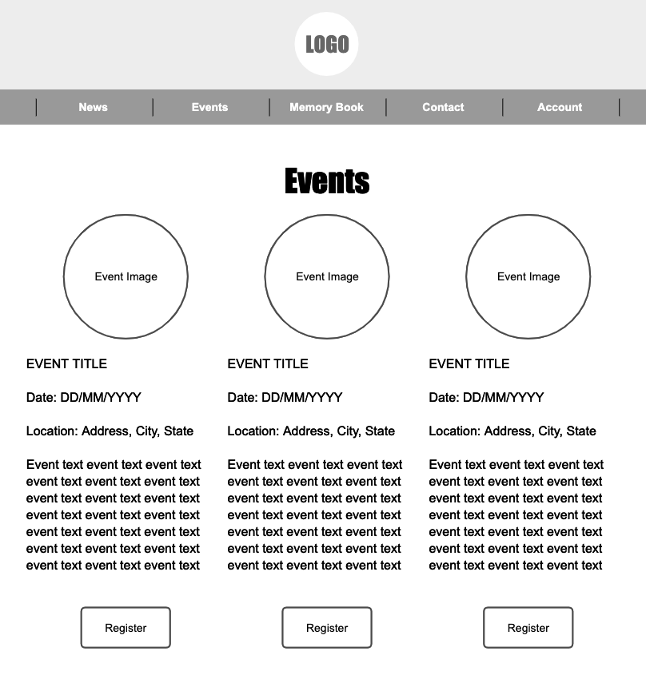
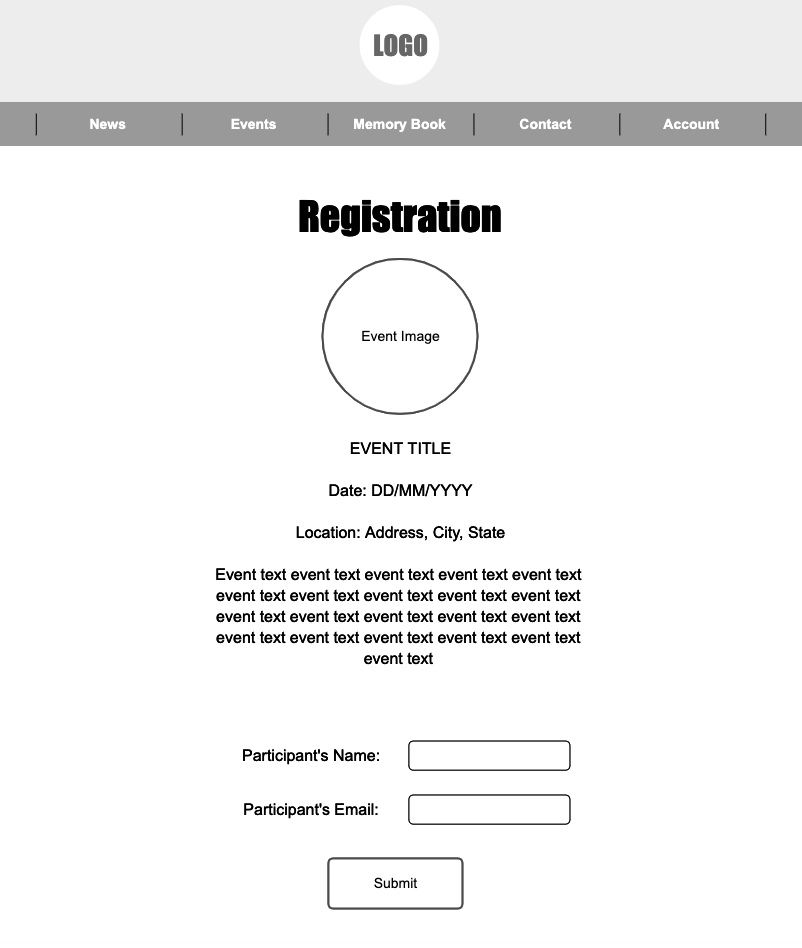
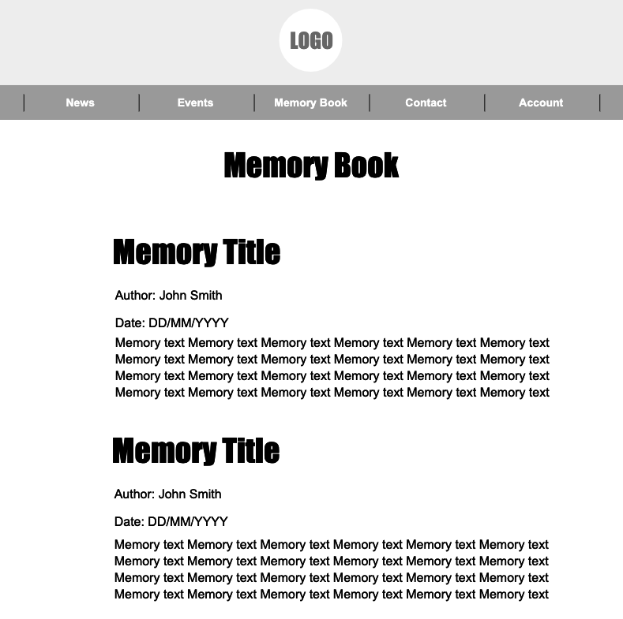
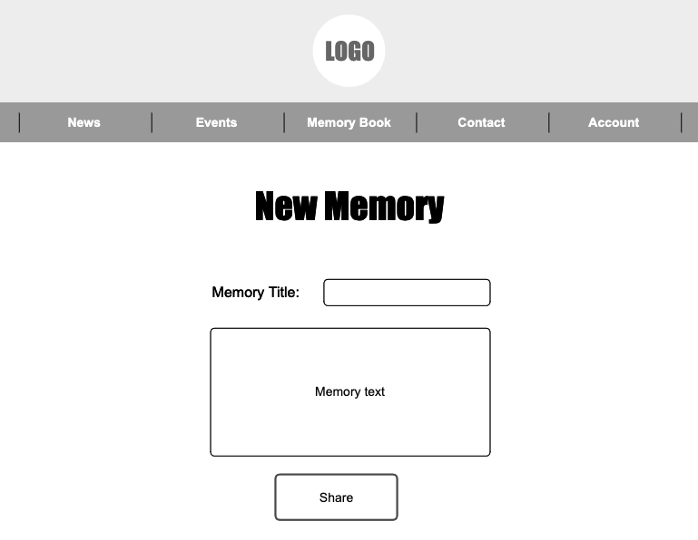
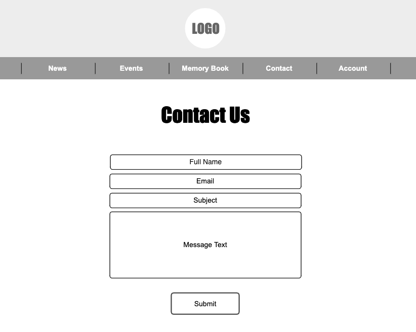
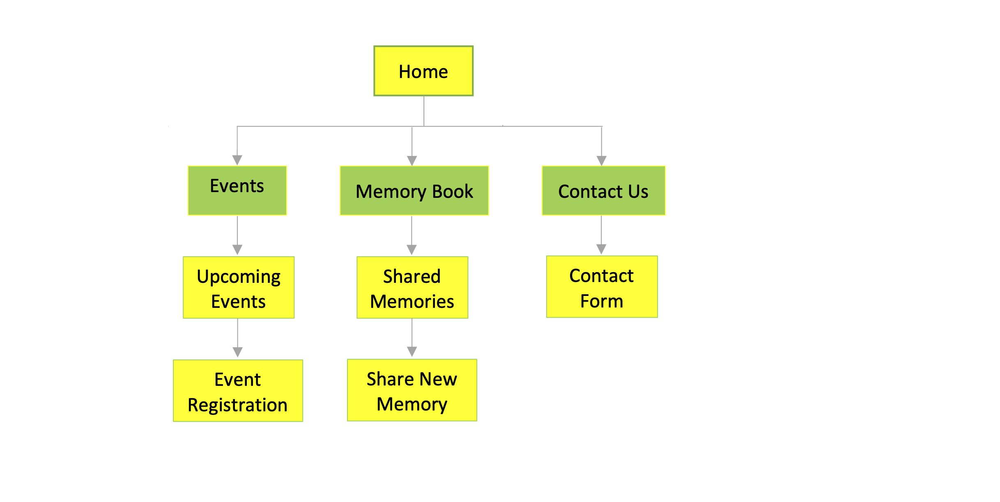

# Team Caleb

## Overview

Team Caleb is a non-profit organization in memory of Caleb Penn Maeir. This organization was designed to provide sports programs in underprivileged communities with the necessary funds and equipment to play the sports every child loves.

This web application is designed for users to register for upcoming TC events and post memories they have of Caleb. 

## Data Model

The application will store Events and Memories	

* Events can have multiple registered participants (individual objects)
* Memories can have authors (individual objects)
* Messages to the company

An Example Event:

```javascript
{
  title: "NYC Marathon",
  date: "2020-03-20T10:30:00.000Z",
  location: "New York, New York",
  participants: [], //an array of registered participant objects
  image: // an optional event image
  createdAt: // timestamp
}
```

An Example Memory:	

```javascript	
{	
  title: "First grade class",	
  author: "Rena Auerbach",	
  text: "I loved being in the same class as Caleb in first grade!",	
  createdAt: // timestamp  	
}	
```	

An Example Message:	

```javascript	
{	
  name: "Rena Auerbach",
  email: "renaauerbach@nyu.edu",	
  subject: "T-shirt size",	
  text: "Hi, I was wondering is the shirts for the Marathon run small? If so, I'd like to change mine to a Medium. Thank you!",	
  createdAt: // timestamp  	
}	
```	

## Wireframes

/events - page for viewing events



/events/register - page for registering for an event



/memories - page for viewing the memory book	

	

/memories/new - page for sharing a new memory 	



/contact - page for contacting the organization



## Site map


